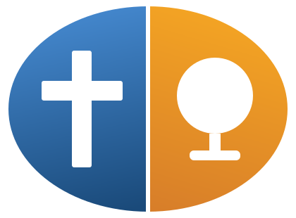

<p align="center">
  
</p>
<h1 align="center">OpenSign</h1>
<p align="center">
  <strong>Free, open-source kiosk &amp; digital-signage software for churches and nonprofits.</strong><br>
  No cloud. No subscription. Runs on hardware you already own.
</p>

---

Point a screen at it — a lobby monitor, a sanctuary TV on a mini-PC — and walk away.
A keyboard-less mini-PC runs the **kiosk**; you set what it shows from the **admin**
page in any browser on your network. Nothing is uploaded, and nothing leaves the
building.

## Modes

The display follows a **mode** (the architecture is built to add more):

- **Text** — a text card: logo + headline + a line.
- **Images** — a **single** still image, or a **slideshow** rotating a folder on a
  timer; with selectable fit (contain / cover / stretch).
- **Stand By** — a black screen with a small server-status note, for intentionally
  showing nothing while the kiosk stays alive.
- *…→* calendar / hymn-lyrics feeds from
  [OpenOrder](https://github.com/TheRevDrJ/OpenOrder) are the planned next modes.

Images are served **in place** from wherever they live on disk — nothing is copied
or uploaded.

## Widgets

Optional **clock** and **calendar** overlays ride on top of whatever mode is running.
Drag each onto a snap grid — set to Landscape or Portrait to match your screen — with
a glass look; add a widget by dragging it on, remove it with a right-click.

Changes in the admin apply the moment you make them (no Save button), and you can
export the whole configuration to a `.json` layout and load it back later.

## Shape

- **Frontend** — Vite + React + TypeScript. `/` is the kiosk display, `/admin` is the
  control panel. One visual theme (HonedEdge), themeable.
- **Backend** — FastAPI. Persists the config, serves local files in place, opens the
  native file/folder picker, and (in production) serves the built frontend on a single
  port. Bundles to a standalone `.exe` via PyInstaller.

Both the kiosk and the admin are reachable from any device on the local network, so you
can configure the wall from your desk.

## Running it (dev)

```sh
# frontend  → http://localhost:6100
cd frontend && npm install && npm run dev

# backend   → http://localhost:6101  (Vite proxies /api to it)
cd backend
uv venv .venv
uv pip install -r requirements.txt
.venv/Scripts/python -m uvicorn app.main:app --host 0.0.0.0 --port 6101 --app-dir .
```

## License

[AGPL-3.0](LICENSE) — use it, modify it, share it. Free forever. If you distribute or
run a modified version as a network service, you must share your changes under the same
license.

## Links

- **Foundation:** [The Honed Edge](https://honededge.org)
- **GitHub:** [TheRevDrJ/OpenSign](https://github.com/TheRevDrJ/OpenSign)

---

Built with [__Ephphatha__](https://github.com/TheRevDrJ). 🙌
